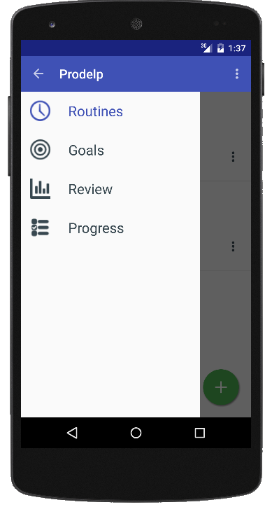
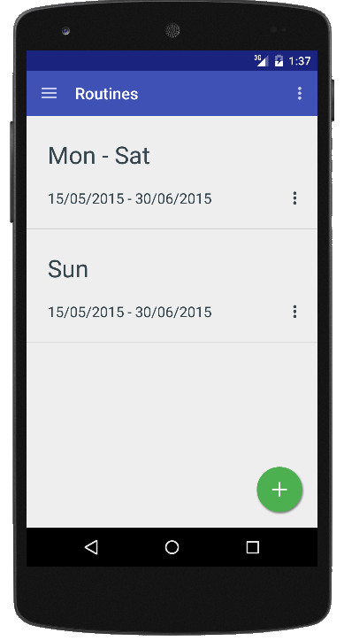
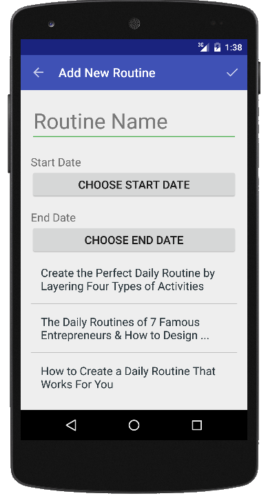
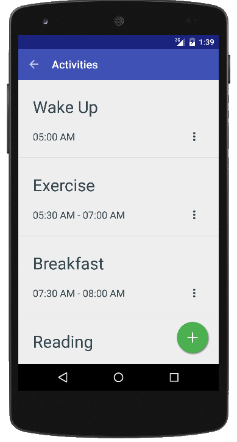
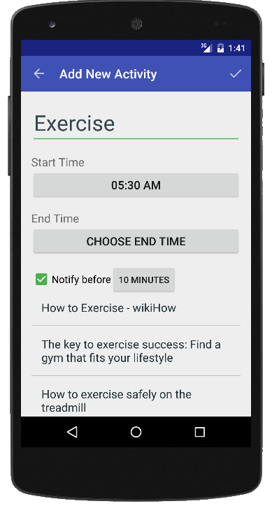
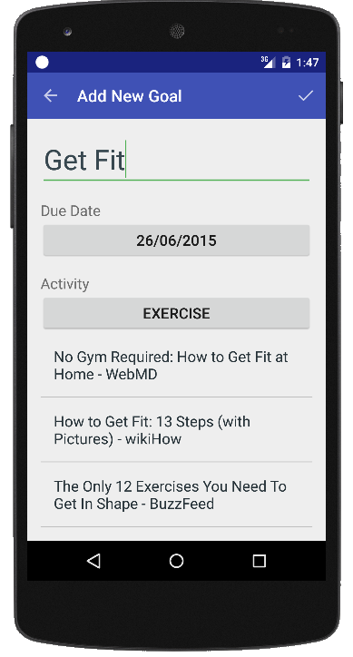
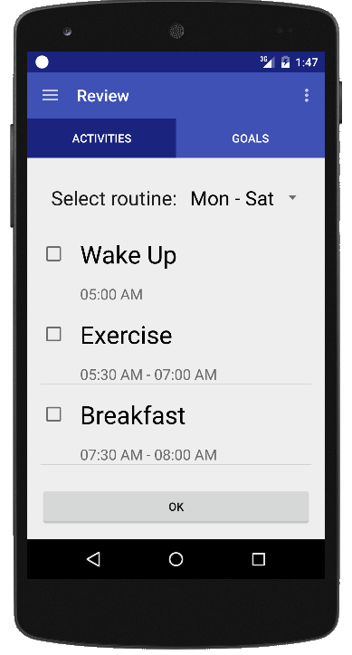
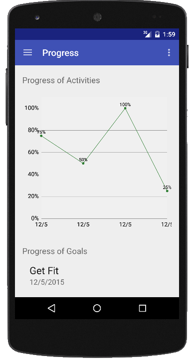

### :small_blue_diamond: Project Year: 2015 :small_blue_diamond:
## Prodelp: Android App for Improving Personal Productivity
### An Android app for creating a routine consisting of activities that we do throughout the day. At the end of the day, we review the activities and see how many of them we have completed.

* Technologies: Java, XML, SQLite
* Platform Features: Content Provider, Loader, Notification, Shared Preferences  
* Tools and OS : Android Studio, Ubuntu
* Platform: Android 4.0+
* Modules: Routines, Goals, Review, Progress
* Lines of Code:  4529
* Duration: 4 Months (FEB 2015 - MAY 2015)

### Screenshots

